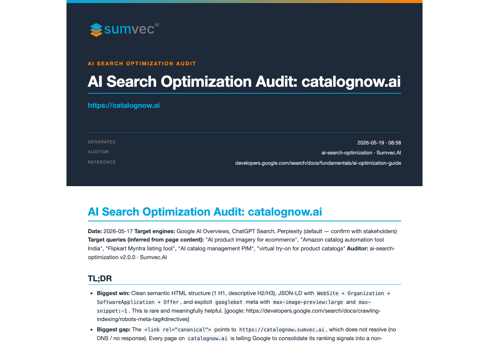

# ai-search-optimization

[](https://opensource.org/licenses/MIT)
[](./.claude-plugin/plugin.json)
[](https://sumvec.ai)

A Claude Code plugin that **audits and optimizes a webpage or site for AI search visibility** — Google AI Overviews, Google AI Mode, ChatGPT Search, Perplexity, Claude, Gemini, and Copilot.



Anchored in [Google's official AI Optimization Guide](https://developers.google.com/search/docs/fundamentals/ai-optimization-guide). Every Google-attributed claim is cited inline. Every recommendation that comes from broader industry practice is explicitly labeled `[Industry practice]`. No SEO mythology, no GEO hacks Google has explicitly debunked.

## What it does

Triggered by phrases like *"audit my homepage for AI search"*, *"why isn't my site showing up in AI Overviews"*, or *"how do I get cited by ChatGPT"*, the skill walks through a structured 10-step audit:

1. Inputs — target URL, queries, engines, audience
2. Crawlability & indexability (robots, sitemap, render mode)
3. Content quality against Google's four published criteria
4. Structured data review with concrete schema recommendations
5. Passage and section structure
6. Entity & topical authority
7. Citation-worthiness and original value
8. AI crawler policy (Google-Extended, GPTBot, ClaudeBot, PerplexityBot…)
9. Measurement plan
10. Prioritized fix list (P0 / P1 / P2 with effort × impact)

The output is a Markdown audit report with a scorecard, findings by section, prioritized action plan, and cited sources.

## Install

```bash
/plugin marketplace add sumvecai/claude-plugins
/plugin install ai-search-optimization@sumvecai
```

Then trigger it naturally — Claude will invoke the skill from descriptions like:

- *"Audit `https://example.com/blog/post` for AI search visibility"*
- *"Is my homepage showing up in Google AI Overviews?"*
- *"How do I get my docs cited by ChatGPT and Perplexity?"*
- *"Review my structured data for AI search"*

Or invoke the slash command directly with a URL:

```
/aiso-audit https://example.com/blog/post
/aiso-audit https://example.com/sitemap.xml
/aiso-audit example.com
```

The command runs the full 10-step workflow, stamps every finding with its source class — `[google: <url>]`, `[research: <url>]`, `[vendor: <url>]`, or `[Industry practice]` — writes the audit to `./aiso-audit-<host>-<date>.md`, **renders a Sumvec-branded HTML report** at `./<host>-<YYYY-MM-DD>-<HHMM>.html` (cover page, brand palette, page numbers, source-attribution footer), and **renders a PDF** at the same base name if a Chromium-family browser (Chrome / Brave / Chromium / Edge) is installed on the machine. For a sitemap or bare domain, it asks which pages to audit first (default: 3–8 representative pages).

For JavaScript-heavy SPAs (Next.js, React, etc.) where the initial HTML carries little content, pass `--render` to `scripts/fetch_and_audit.py` and the script will use the same headless browser to fetch the post-JS rendered DOM:

```bash
python scripts/fetch_and_audit.py --render https://example.com
```

**Zero external dependencies.** The plugin's helper scripts use only the Python standard library. No `pip install`, no `brew install`. If no Chromium-family browser is installed, the HTML is still produced and you can print-to-PDF from any browser (Cmd-P / Ctrl-P → Save as PDF).

You can also invoke the skill without a slash command:

```
/ai-search-optimization:ai-search-optimization
```

## What's inside

```
ai-search-optimization/
├── .claude-plugin/
│   └── plugin.json
├── commands/
│   └── aiso-audit.md                         ← /aiso-audit <url-or-sitemap>
├── skills/
│   └── ai-search-optimization/
│       ├── SKILL.md                          ← the playbook
│       ├── references/                       ← loaded on demand
│       │   ├── google-aiso-principles.md     ← Google's guide distilled with citations
│       │   ├── schema-templates.md           ← which Schema.org type by page type
│       │   ├── audit-rubric.md               ← 10-dimension 1–5 scoring rubric
│       │   ├── llms-txt-guide.md             ← honest treatment of llms.txt
│       │   └── multi-engine-notes.md         ← engine-by-engine differences
│       ├── assets/                           ← drop-in templates
│       │   ├── schema-article.jsonld
│       │   ├── schema-faq.jsonld
│       │   ├── schema-howto.jsonld
│       │   ├── schema-organization.jsonld
│       │   ├── schema-breadcrumb.jsonld
│       │   ├── schema-product.jsonld
│       │   ├── llms.txt.example
│       │   └── prepublish-checklist.md
│       └── scripts/                          ← stdlib-only helpers (no pip required)
│           ├── _chrome.py                    ← shared Chromium-family browser detection
│           ├── fetch_and_audit.py            ← URL → Markdown audit summary (use --render for SPAs)
│           ├── check_schema.py               ← JSON-LD validity & missing fields
│           └── generate_report.py            ← branded HTML always, PDF if a Chromium-family browser is installed
├── tests/
│   └── test_check_schema.py                  ← unittest, stdlib only, runs in CI
└── media/
    └── audit-cover-preview.png
├── README.md
└── LICENSE
```

## The Sumvec stance

Most "AI SEO" content sells tactics. Google's [own guide](https://developers.google.com/search/docs/fundamentals/ai-optimization-guide) explicitly debunks several of them — `llms.txt`, content chunking, AI-only rewrites, and "special schema for AI Overviews" do not make pages appear in Google's AI features. Other engines (ChatGPT Search, Perplexity, Claude with web search) use different pipelines and *some* of those tactics matter for *them*.

This plugin treats that tension honestly:

- **Recommendations Google states** are cited directly to `developers.google.com`.
- **Recommendations that come from industry practice** are clearly tagged so you know you're acting on community guidance, not Google policy.
- **Engine-specific advice** is segregated so you can choose which engine to optimize for.

That's why this skill is useful: it replaces vague "boost your AI visibility" advice with concrete, attributable, executable changes.

## Freshness

Last reviewed against Google's guide: **2026-05-17** (Google's page was last updated 2026-05-15).

Google's guidance for AI Overviews is still evolving. We re-read the canonical guide quarterly and bump the plugin version when material changes. Watch the [changelog](https://github.com/SumvecAI/claude-plugins/blob/main/plugins/ai-search-optimization/CHANGELOG.md) or `/plugin update` periodically.

## Limitations & honest caveats

- **No guarantees.** Google explicitly says *"indexing and serving aren't guaranteed."* This plugin helps a site meet the bar; it doesn't promise visibility.
- **Not engine-affiliated.** This plugin is not endorsed by Google, OpenAI, Anthropic, or Perplexity. We just read their public guidance and crawler policies.
- **JS-rendered pages.** The bundled `fetch_and_audit.py` script does a static fetch — it flags JS-heavy pages but cannot execute JS. For client-rendered sites, audit the rendered HTML separately (e.g., Chrome devtools "Copy outer HTML" after render).
- **Industry recommendations move fast.** Anything tagged `[Industry practice]` reflects what's commonly recommended as of the plugin's last review date; verify before applying to high-stakes pages.

## Versioning policy

Semantic versioning:

- **Patch (1.0.x):** documentation tweaks, citation refreshes, typo fixes.
- **Minor (1.x.0):** new reference files, new schema templates, new audit dimensions, new scripts.
- **Major (x.0.0):** breaking changes to the audit output format or skill triggering.

## Contributing & feedback

- **Issues, suggestions, Google-guidance changes:** open a [GitHub issue](https://github.com/SumvecAI/claude-plugins/issues).
- **Direct feedback:** [connect@sumvec.ai](mailto:connect@sumvec.ai).

## License

[MIT](./LICENSE). Copyright (c) 2026 Sumvec.ai.

## Built by

[](https://sumvec.ai)

Practical AI tooling for marketers, founders, and operators who care about doing the work properly. [sumvec.ai](https://sumvec.ai).
